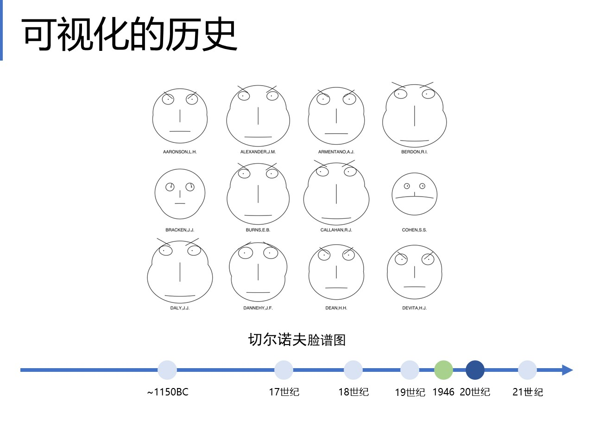
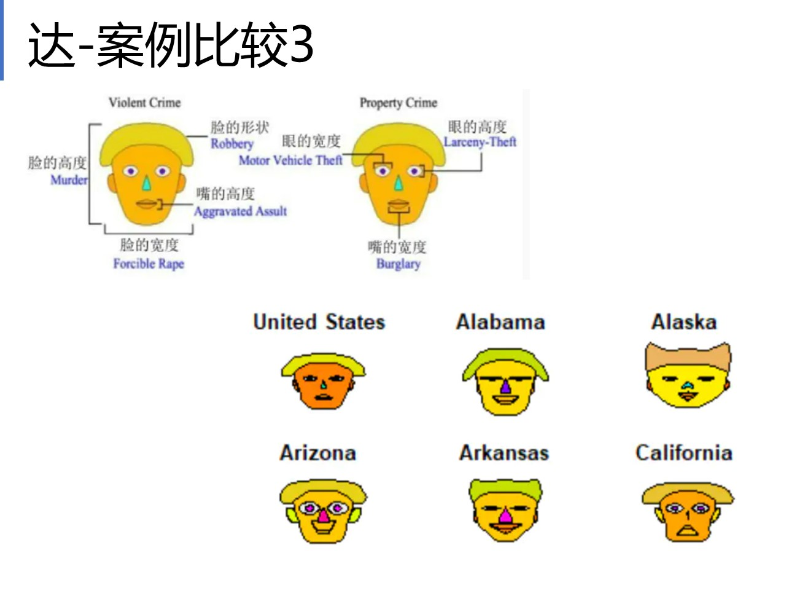
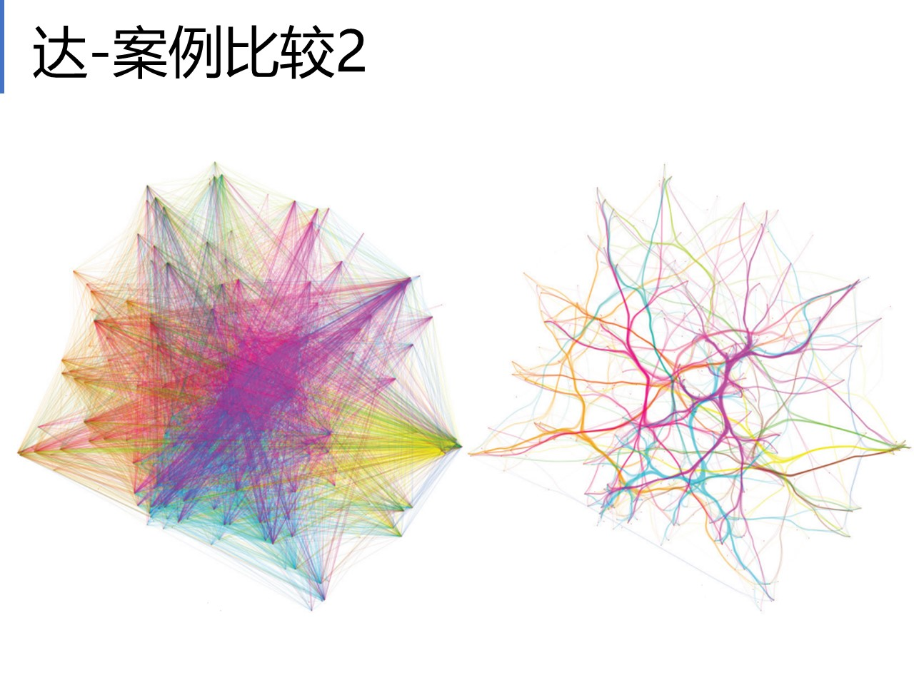

- 应用类课程
  - 数据可视化案例
  - 方法
  - 前端开发技术

[TOC]

# 分数

# 安排

# 可视化简介

## Introduction

- what

  

  - Data->visualized->被感知

- why
  - 增强记忆，帮助思考
  - 用视觉增强数据认知能力
    - 可视分析：基于交互界面，人和机器合作分析数据（人参与到数据分析之中）。机器直接建模+人通过可视化工具感知之后做总结。

- 可视化的分支
  - 科学可视化，可视化三维现象（气象、医学），展示数据本身
  - 信息可视化，改进可视化，增强人类对数据的感知
  - 可视分析，用可视化更好地分析数据

## Evaluation

- what makes visualization great

  - 信

  - 达

    - 去除无关的
    - 去除不必要的信息重复
    - 合理组织信息，避免遮挡

    

    右图做了路径捆绑

    

    

  - 雅

    

    

- Evaluation

  - ==可视化的目的==是帮助用户了解数据，产生见解insight
  - Case Study，通过多次使用其来展示数据，记录效果，然后分析其是否有效
  - User Study，广泛调研
  - Expert Interview，代表性观点

> 老师你真的挺努力的竟然还有演讲者视图……

# 数据

- 大数据
  - 数据量大
  - 需要被快速接收和处理
  - 包括数值，文本，多媒体
  - 可信度高
  - 价值高
- 数据
  - 结构化（eg. 表格）
    - 行：Record(of one object)
    - 列：Attribute(of all objects)
      - 数值型属性Numerical：离散/连续（有时区分不大）
      - 有序型属性Ordinal：排序/名次（脱离比较的状态本身没有意义）
      - 类别型属性Catagorical：离散的分类，可能有层次关系
  - 非结构化（eg. 文本）

## 数据管理

- 数据来源

  - 政府公开 National Data
  - 开源网站 Kaggle, UCI为机器学习提供的数据库，SNAP(网络数据)
  - 数据分析竞赛

- 数据质量

  - 事前规范收集
  - 事后数据清洗

- 数据集成

  - 把来自不同来源的数据整合
  - 提供统一的接口

- 数据存储

  - 文件==半结构化存储==

    为什么是半结构化？因为结构化不仅存在模型，还要对具体的数据格式进行规范，而csv没有做规范

    - `.csv`

    - `.json` 比csv更加灵活但是也更加冗余

    - `.xml`  extensible markup language 可拓展标记语言

      

      - `.kml` 用以做地标

  - 数据库==结构化存储==

    - 关系型RDBMS
    - 非关系型NoSQL

## 数据挖掘KDD

- 描述任务
  - 概念描述
  - 关联分析
  - 聚类
  - 异常识别
- 预测任务
  - 分类（找到一个模型用于对数据分类
  - 演变分析（分析数据的时间和空间模式，用于预测，eg. 天气预报、股市分析）

- 方法

  - 统计

    - 基本统计描述

      - 提供数据的整体概览
      - 提供深入数据分析的切入点（基础
      - 常用：均值、中位数、方差

    - 不相似性计算

      - 欧氏距离
      - 曼哈顿距离

    - 相似性计算

      - 余弦

      - 皮尔森相关系数（线性相关程度

        

  - ML

  - 算法

