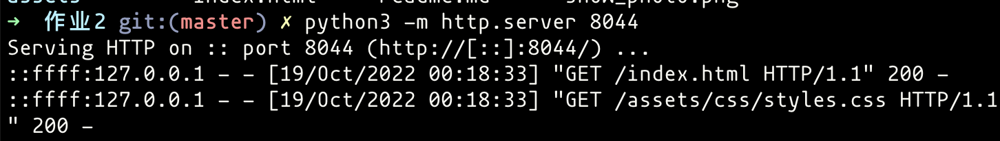

> 1911590 周安琪 10.19

# 快速运行

通过在相应文件夹下运行此指令，可以快速建立一个本地服务器。

```bash
python3 -m http.server 8044
```

在浏览器用`127.0.0.1:8044/index.html`访问页面，同时控制台可以看到客户端发来的请求。



# 结构介绍

- assets
  - css
    - styles.css 定义html文件的格式
  - img
- index.html 静态网页

# 任务完成

- img：猫猫头+section_1的background
- Svg：猫猫头外面的圆
- 表格：最下方
- 表单：导航栏的搜索框
- 超链接：指向github & codeforce & leetcode的图标


注：最下方表格的样式是参考了我的typora主题，logo来自在线网站提供的在线css文件和图标。
