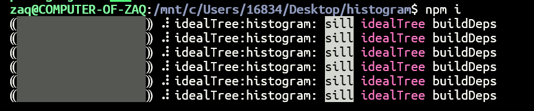
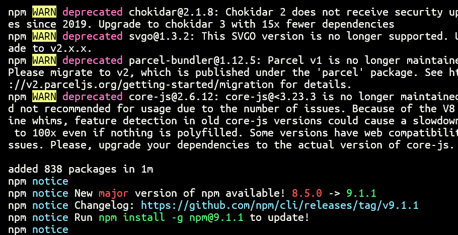
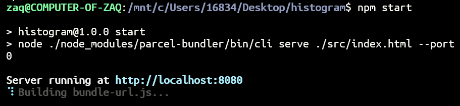
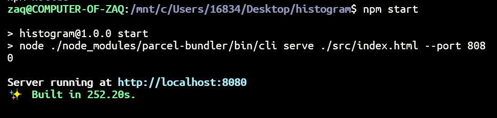
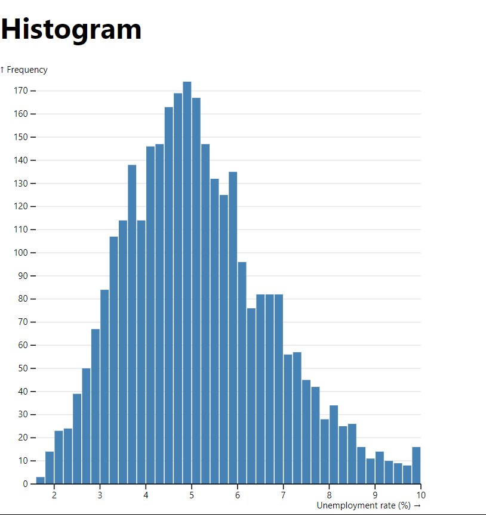
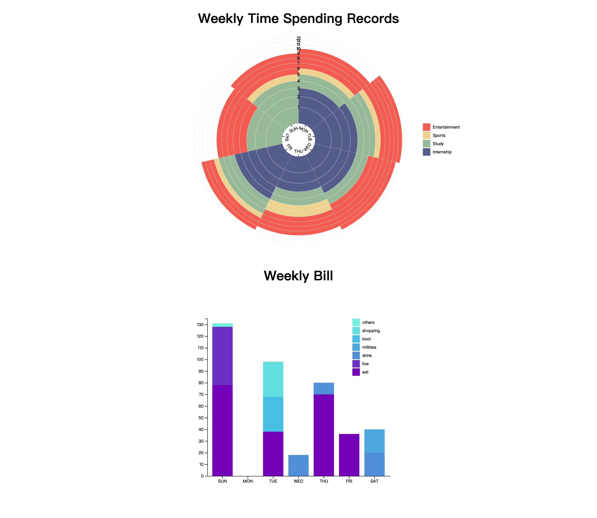

# 作业4

> 1911590周安琪

- 配置项目

  在项目目录下打开终端，输入`npm i `

  

  一直停在这里，我上网搜了一下，说是换成淘宝的镜像源：https://blog.csdn.net/weixin_46182244/article/details/121302702

  

- 运行项目

  在项目目录下打开终端，输入`npm start`如没有更改设置，项目将自动在 http://localhost:8080 运行，可以打开网址查看项目。 

  

  

  （一件怪异的事情：我直接`127.0.0.1`不行，非得`localhost`，我不理解，我查了一下说是localhost不走网卡的）

  

- 终止项目 在终端按 Ctrl+C，再输入 y 

- 理解项目 理解文件之间的引用关系，理解项目文件，特别是 histogram.js 中每行代码的意图。

- 调整项目 通过修改 main.js, histogram.js 和 style.css，尝试不同图表调整（适应屏幕范围/更改图表 颜色/增加文字说明/切换图表类型…） 

# 实验结果

写的时候不是用node build的，写完了死活build不成功……直接打开html是可以的。