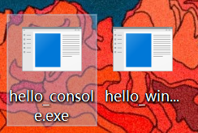

# 汇编语言与逆向技术实验报告

# Lab1 - HelloWorld

<center><b>学号：</b>1911590   <b>姓名：</b>周安琪 <b>专业：</b>计算机科学与技术</center>

## 实验内容

- 熟悉Win32汇编MASM32的编译环境
- 命令行输出"HelloWorld"
- 窗口输出"HelloWorld"

## 实验步骤

### 下载和安装

从MASM32官网下载zip安装包，随后按照指引一步步安装。


### 生成.asm源程序


对源程序的解析如下：

#### hello_console.asm

```assembly
.386
```

表示使用的指令集是386的。

```assembly
.model flat, stdcall
```

表示程序的内存模式是flat。

stdcall说明了参数的传递约定，包括参数传递时压栈的顺序和由谁恢复栈指针。

```assembly
option casemap :none
```

指定标签为大小写敏感

```assembly
include \masm32\include\windows.inc
include \masm32\include\kernel32.inc
include \masm32\include\masm32.inc
includelib \masm32\lib\kernel32.lib
includelib \masm32\lib\masm32.lib
```

引用一些库函数。

```assembly
.data
```

表示数据段（并非真正表意），程序中需要使用的数据保存在这里，该段为可读的。

```assembly
str_hello BYTE "Hello World!", 0
```

指定 `str_hello` 的内容是 `"Hello World!"`，0代表字符串的末尾。

```assembly
.code
```

表示代码段。

```assembly
start:
```

表示代码的开始。

```assembly
invoke StdOut, addr str_hello
```

invoke关键字表示这个函数是从其它库中导入的。它调用输出函数stdOut，传入的参数是str_hello的地址。

```assembly
invoke ExitProcess, 0
```

调用退出程序的函数ExitProcess。

```assembly
END start
```

#### hello_window.asm

其他都和 `hello_console.asm` 一致。

```assembly
invoke MessageBox, NULL, addr str_hello, addr str_hello, MB_OK 
```

调用函数MessageBox，第一个str_hello是作为对话框的标题，第二个str_hello是作为对话框的内容。

### 对源程序进行汇编生成.obj文件


下面是对该汇编指令的解析：

```bash
\masm32\bin\ml /c /Zd /coff hello_console.asm
```

`\masm32\bin\ml` 是汇编器可执行程序的路径地址。

`/c` 指定这一步操作只编译不链接。

`/coff` 是指定产生的目标文件的格式是coff。

`/Zd` 是给目标文件加上调试信息。

### 对目标程序进行链接生成.exe文件




```bash
\masm32\bin\link /SUBSYSTEM:CONSOLE hello_console.obj
```

`/SUBSYSTEM` 是告诉链接器可执行文件的运行平台是，在这两个case中分别是CONSOLE和WINDOWS。

### 执行可执行文件

Console Hello World：


MessageBox Hello World：


## 实验截图

详情见上文。

## 实验心得

在这次实验中了解了更多汇编语言的细节，也增加了实践经验。